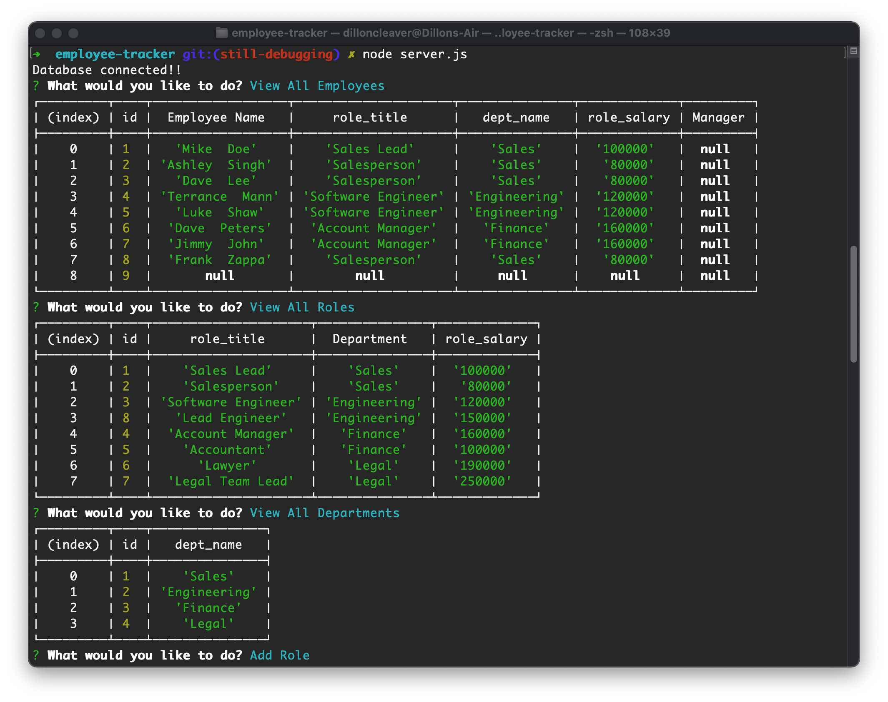

# Employee Tracker
Boot Camp HW # 10

## Project Description
- This is a simple terminal application that queries and updates a SQL database.
- With this application you can see a list of employees from the SQL database, add roles, departments, new employees and you also have the ability to update role and departemtn information about employees in the database.
- To run this application you'll need to clone the application to your local machine, install the dependencies listed in the package.json file.
- You'll also need to use a SQL database application such as MySQL and then run the schema.sql file to build the database locally.
- Then navigate to the root of the folder and run node index.js.
- You will then be presented with some prompts which will allow you to start building your team.

## Application Walkthrough Video
- https://watch.screencastify.com/v/bmGRE9OQAI05R1x8itn8

## Screenshot

## Website Link
- https://github.com/cleadi/employee-tracker

## Contact
- If you wish to reach me, feel free to send me an email at cleadi@fastmail.com
- I can also be reached via LinkedIn: https://www.linkedin.com/in/dillon-cleaver/
- GitHub profile: https://github.com/cleadi